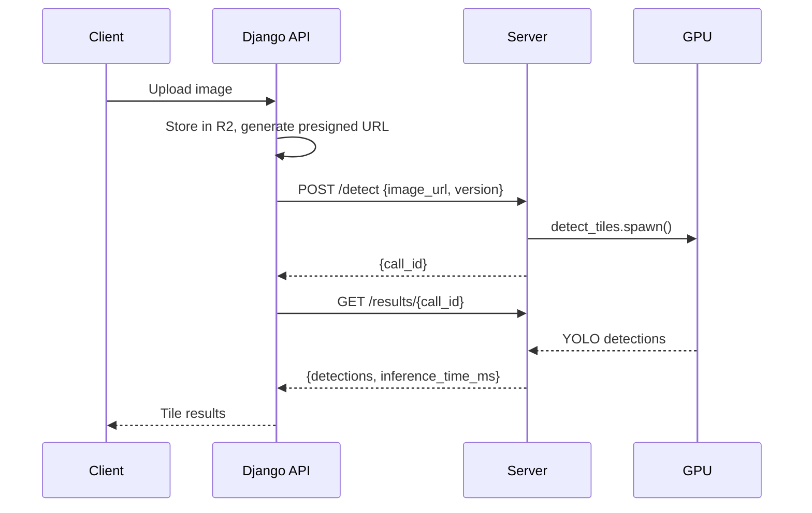

# Mahjong CV Detector — Modal

Serverless mahjong tile detection on [Modal](https://modal.com). Accepts an image URL, runs YOLO on a T4 GPU, and returns detected tile codes with bounding boxes.

## Architecture



## Quick Setup

1. Set up Modal CLI and link to workspace:
   ```bash
   modal setup
   ```

2. Test locally:
   ```bash
   modal serve -m modal_app.src.app
   ```

3. Deploy — push to `main` to trigger CI/CD deployment to Modal.

## Project Structure

```
modal_app/src/
├── app.py         # Modal App + shared container image
├── server.py      # FastAPI endpoints (POST /detect, GET /results)
├── detect.py      # YOLO inference (T4 GPU)
└── utils.py       # Tile code + model version validation
```
